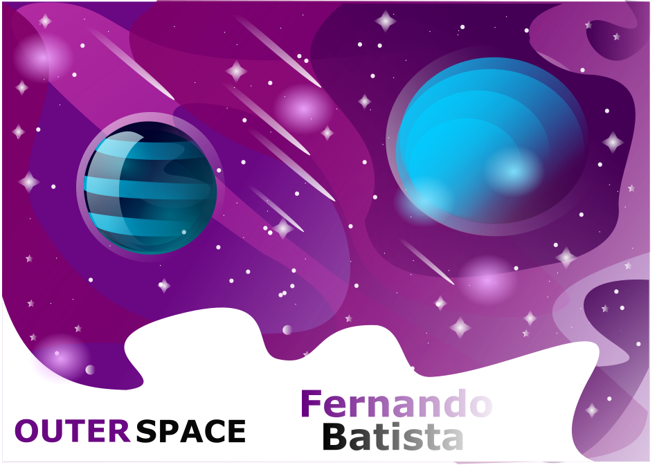

<h1 align="center">Fernando Batista</h1>

Designed by Fernando Batista

<h1 style="color: blueviolet">Fernando Batista</h1>

Hello, I am Fernando Batista, graduated in Computer Engineering living in São Paulo, Brazil.

I'm Full Stack Developer Jr. 

I am interested in design and webdesign also.

<h2>The stack</h2>

<h2>Design</h2>

)

 UNDER CONSTRUCTION...

